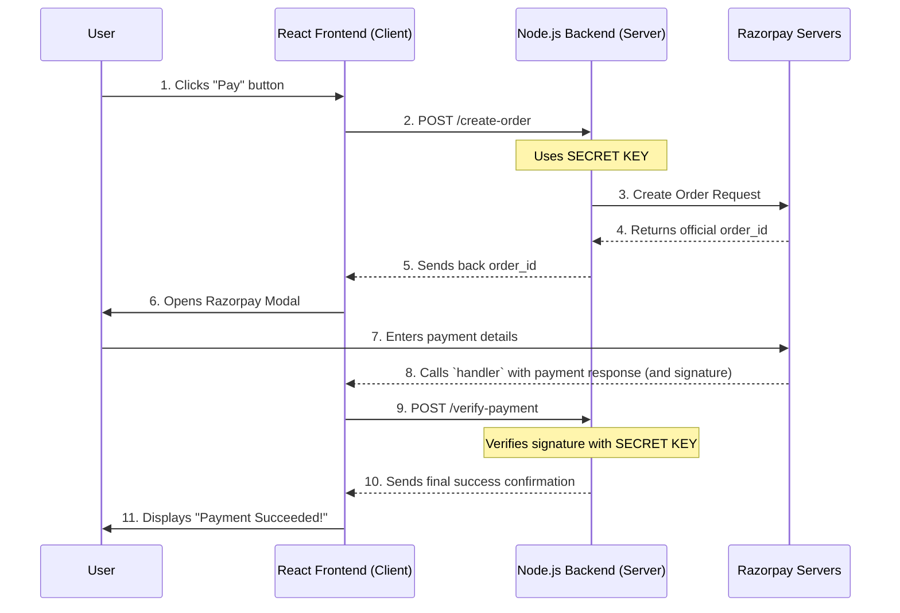

### System Design Flow

```mermaid
sequenceDiagram
    participant User
    participant React Frontend (Client)
    participant Node.js Backend (Server)
    participant Razorpay Servers

    User->>React Frontend (Client): 1. Clicks "Pay" button
    
    React Frontend (Client)->>Node.js Backend (Server): 2. POST /create-order
    Note over Node.js Backend (Server): Uses SECRET KEY
    
    Node.js Backend (Server)->>Razorpay Servers: 3. Create Order Request
    Razorpay Servers-->>Node.js Backend (Server): 4. Returns official order_id
    
    Node.js Backend (Server)-->>React Frontend (Client): 5. Sends back order_id
    
    React Frontend (Client)->>User: 6. Opens Razorpay Modal
    
    User->>Razorpay Servers: 7. Enters payment details
    Razorpay Servers-->>React Frontend (Client): 8. Calls `handler` with payment response (and signature)

    React Frontend (Client)->>Node.js Backend (Server): 9. POST /verify-payment
    Note over Node.js Backend (Server): Verifies signature with SECRET KEY

    Node.js Backend (Server)-->>React Frontend (Client): 10. Sends final success confirmation
    
    React Frontend (Client)->>User: 11. Displays "Payment Succeeded!"
```